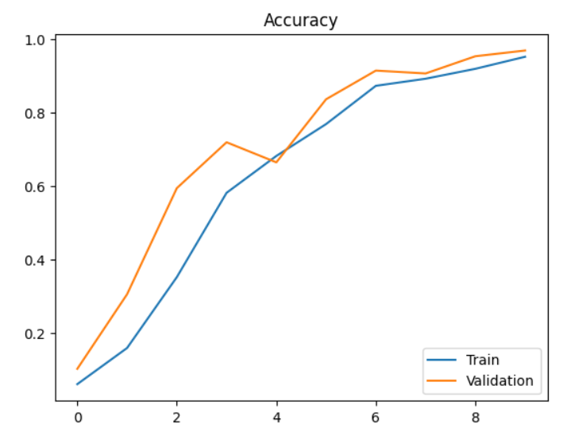
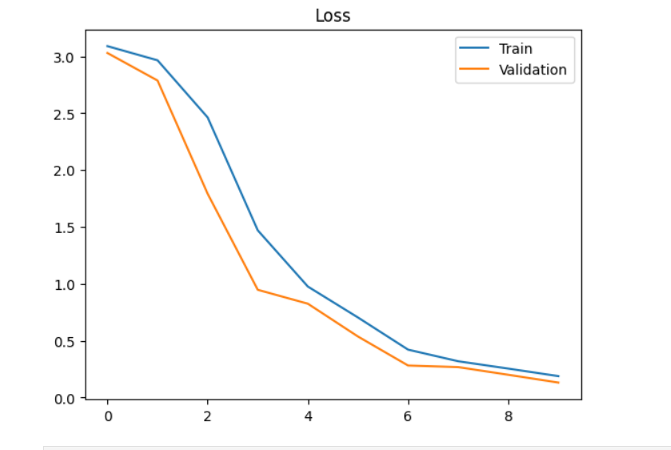
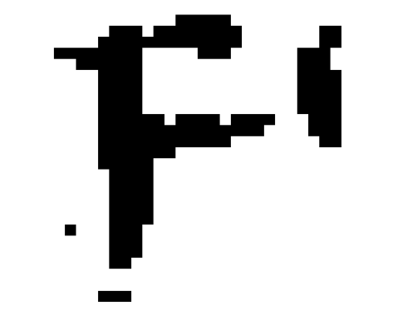

# Manuscript Letter Recognition using CNN

## Overview
This project uses a **Convolutional Neural Network (CNN)** to recognize handwritten/manuscript letters from images.  
The model achieves **~96% accuracy**, and the repository contains scripts for training, testing, and visualizing results.

## Features
- Handwritten/manuscript letter recognition
- High accuracy (~96%)
- Training loss & accuracy visualization
- Sample predictions on manuscript images

## Dataset
- Images of handwritten letters in `.bmp` format
- Images resized to `28x28` pixels for model training

## Results

- **Accuracy & Loss Graph:**

 


- **Sample Manuscript Letters:**  
  


## Installation
Clone this repository and install the dependencies:

```bash
git clone https://github.com/<YourUsername>/Manuscript-letter-Recognition.git
cd Manuscript-letter-Recognition
